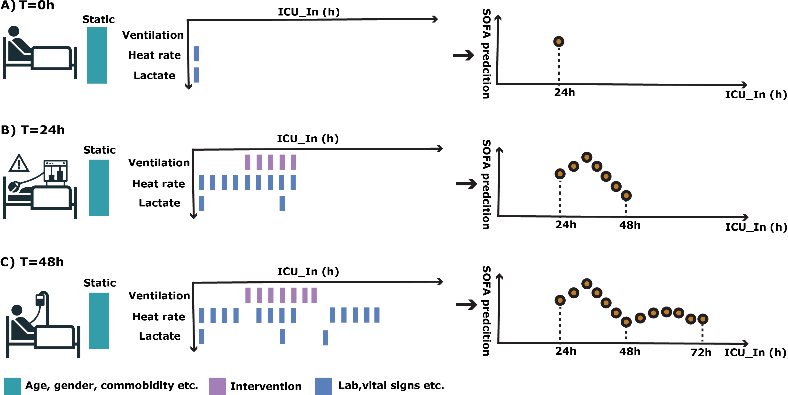
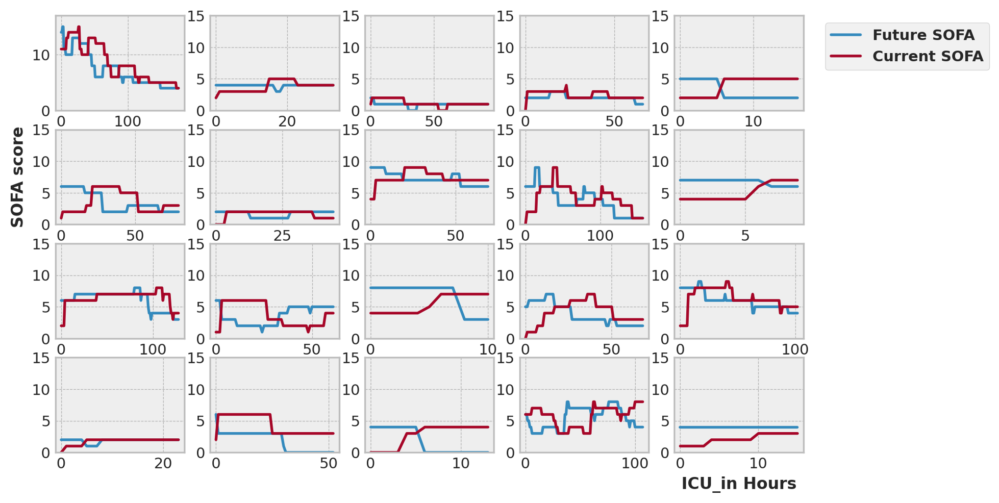
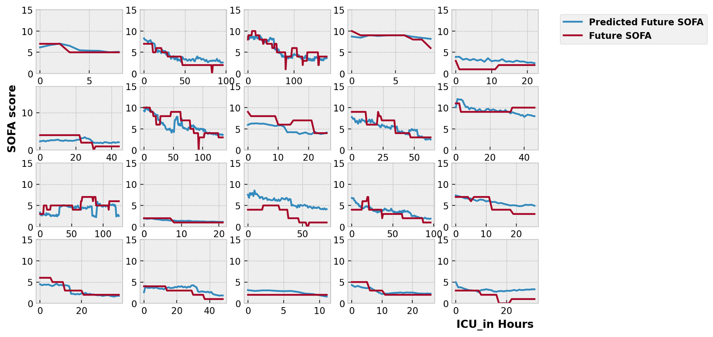

# SOFA_24h
Predict 24h later SOFA score using MIMIC-IV and eICU data 

## 1. Models 
### Temporal Convolutional Network (TCN)

	python main.py --model_name TCN --num_channels 256 256 256 256 --kernel_size 3 --checkpoint test 

### Tranformer model 

	python main.py  --model_name Transformer --d_model 256 --n_head 8 --dim_ff_mul 4 --num_enc_layer 2 --checkpoint test

### LSTM model 
	python main.py  --model_name RNN --hidden_dim 256 --layer_dim 3 --checkpoint test

## 2. Cohorts 
To use sepsis-3 cohort: do 

	python main.py --use_sepsis3 --model_name TCN --num_channels 256 256 256 256 --kernel_size 3 --checkpoint test

## 3. Data batching 

Different ways of data batching: same, close, random. Default is **close**, 

**Same**: each minibatch has the same length of records. This sets an upper limit on the batch size since length 216 records are not common in MIMIC-IV. 

**Close**: each minibatch has very close length of records. This way data padding is minimal. The parameter to set how close they are is *bucket_size* default is 300. The smaller this parameter, the closer of the length in each minibatch. 

**Random**: random minibatch. Under this, each batch could have mixture of length 1 and length 200 records. 

## 4. results

If we use the naive hypothesis, under which patient SOFA scores don't change during 24h, we get a huge error (MSE: 6.34). As can be seen in the following randomly selected 20 records. 

If we use the TCN model, we can see it predicts the rapidly changing trends (MSE: 2.54). 

